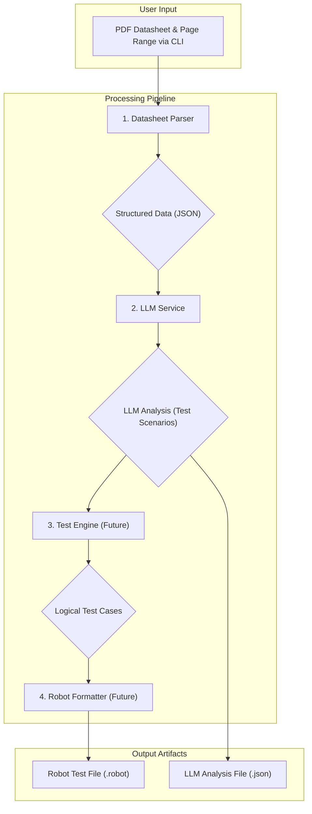

# System Architecture: LLM-Powered Automotive Test Generator

## 1. Overview

The Automotive LLM Test Generator is a command-line tool that automates the creation of Robot Framework test cases from technical PDF datasheets. It uses local, open-source Large Language Models (LLMs) to analyze datasheet content and generate meaningful test scenarios for automotive microcontroller unit (MCU) validation.

The system is designed to be:
- **Modular**: Each processing stage is a separate component.
- **Local-First**: Ensures data privacy by running entirely offline with Ollama.
- **Extensible**: Can be adapted for new LLM models, document formats, or test frameworks.
- **Configurable**: Key parameters like model names and prompts can be changed without altering code.

## 2. System Workflow

The system processes data in a sequential pipeline, transforming a raw PDF datasheet into a ready-to-use Robot Framework test file.

### Step 1: User Input
The process starts with the user providing a PDF datasheet and specifying a page range via the command-line interface (CLI).

- **Input**: PDF file path (e.g., `datasheets/stm32f446re.pdf`).
- **Arguments**: Page range for analysis (e.g., `--start 186 --end 190`).

### Step 2: PDF Parsing
The **Datasheet Parser** reads the specified pages from the PDF and extracts relevant information.

- **Action**: Scans pages for text and tables.
- **Output**: A structured JSON object containing extracted text and tables, where each table is converted into a list of rows with headers.

### Step 3: LLM Analysis
The structured data is sent to the **LLM Service**, which uses a local LLM (via Ollama) to interpret the data.

- **Action**: A carefully engineered prompt instructs the LLM to analyze the tables (typically register maps) and identify testable scenarios.
- **Output**: A JSON object containing the LLM's analysis, including register details, potential test cases, and boundary conditions.

### Step 4: Test Logic Generation
The **Test Engine** takes the LLM's analysis and translates high-level test ideas into concrete, logical test cases.

- **Action**: Converts scenarios like "Test boundary conditions" into specific actions (e.g., "Test write max value," "Test write min value").
- **Output**: A list of logical test case objects ready for formatting.

### Step 5: Robot Framework Formatting
The **Robot Formatter** converts the logical test cases into the final output format.

- **Action**: Generates the `*** Settings ***`, `*** Variables ***`, and `*** Test Cases ***` sections of a Robot Framework file.
- **Output**: A syntactically correct `.robot` file.

### Step 6: Final Output
The pipeline produces two key artifacts, which are saved in the `output/` directory.

- **LLM Analysis File**: A `.json` file containing the structured analysis from the LLM.
- **Robot Test File**: A `.robot` file containing the generated test cases.

## 3. Component Deep Dive

### 3.1. CLI Tool (`src/cli.py`)
- **Purpose**: The main entry point and user interface for the application.
- **Responsibilities**:
    - Parse command-line arguments (`analyze`, `find-pages`, `test-connection`).
    - Validate user inputs like file paths and page numbers.
    - Orchestrate the workflow by calling other components in sequence.

### 3.2. Datasheet Parser (`src/datasheet_parser/`)
- **Purpose**: To ingest the raw PDF and transform its content into a structured, machine-readable format.
- **Responsibilities**:
    - Extract raw text and tables from specified PDF pages using `PyMuPDF`.
    - Convert tables into a clean, structured format (list of dictionaries).
    - Export the parsed document structure to a JSON file for debugging.
- **Input**: PDF file path and page range.
- **Output**: Structured data (text and tables).

### 3.3. LLM Service (`src/llm_service/ollama_client.py`)
- **Purpose**: The "brain" of the system that performs intelligent analysis using an LLM.
- **Responsibilities**:
    - Communicate with the local Ollama server.
    - Use prompt templates to instruct the LLM on its analysis task.
    - Force the LLM to return its analysis in a structured JSON format.
    - Handle potential errors in the LLM's JSON response.
- **Input**: Structured data from the Datasheet Parser.
- **Output**: A JSON object with test scenarios and register details.

### 3.4. Test Engine (`src/test_generator/test_engine.py`)
- **Purpose**: Translates high-level test ideas from the LLM into concrete, logical test cases.
- **Responsibilities**:
    - Generate specific test objects based on automotive testing principles (e.g., boundary, state transition, and error injection tests).
    - Map test ideas like "Test boundary conditions" to specific logical tests like `Test_Write_Max_Value`.
- **Input**: The analysis JSON from the LLM Service.
- **Output**: A list of logical test case objects.

### 3.5. Robot Formatter (`src/robot_formatter/formatter.py`)
- **Purpose**: The final stage, responsible for converting logical tests into a valid `.robot` file.
- **Responsibilities**:
    - Generate the standard sections of a Robot Framework file.
    - Format each test case with the correct syntax, keywords, and arguments.
    - Add documentation to each test case based on the context from the LLM.
- **Input**: A list of logical test case objects from the Test Engine.
- **Output**: A formatted `.robot` file.

## 4. Technology Stack

| Category         | Technology / Library   | Purpose                                    |
| ---------------- | ---------------------- | ------------------------------------------ |
| **Language**     | Python 3.11+           | Core application language                  |
| **Containerization**| Docker, Docker Compose | Environment consistency and portability    |
| **PDF Processing**| PyMuPDF (fitz)         | PDF text and table extraction              |
| **Data Handling**  | Pandas                 | Manipulation of extracted table data       |
| **LLM Engine**   | Ollama                 | Local hosting of open-source LLMs          |
| **LLM Model**    | Phi-3 / Llama 3.2      | AI model for analysis and generation       |
| **AI Framework** | LangChain              | Prompt templating and LLM interaction      |
| **CLI**          | argparse               | Building the command-line interface        |
| **Test Framework**| Robot Framework        | Target output format for generated tests   |
| **CI/CD**        | GitHub Actions (Planned)| Automated testing, linting, and building   |

## 5. Future Roadmap

- **Web UI**: Develop a web interface (using Flask or Streamlit) for a more graphical user experience.
- **Advanced Parsing**: Incorporate OCR (e.g., Tesseract) to handle scanned datasheets and complex diagrams.
- **Broader LLM Support**: Add connectors for other LLM hosting platforms like Hugging Face.
- **Vector Database Integration**: Use a vector DB (e.g., ChromaDB) to enable semantic search across the entire datasheet.

## 6. Architecture Diagram

The following diagram illustrates the data flow through the system, from initial user input to the final generated artifacts.

