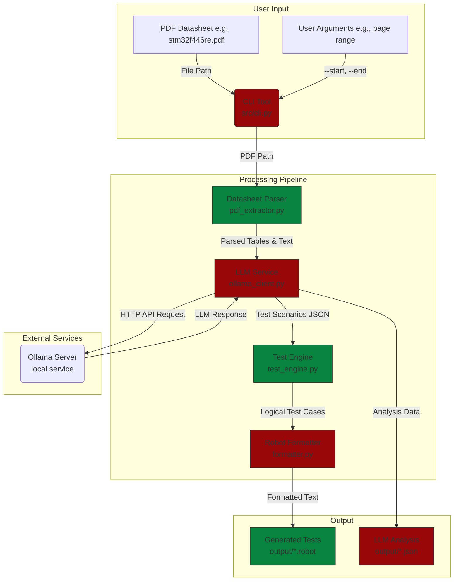

# System Architecture: LLM-Powered Automotive Test Generator

## 1. Introduction

This document outlines the system architecture for the **Automotive LLM Test Generator**, a tool designed to automate the creation of Robot Framework test cases from technical PDF datasheets. The system leverages local, open-source Large Language Models (LLMs) to analyze structured data (tables) and unstructured text from datasheets, intelligently generating relevant and comprehensive test scenarios for automotive MCU validation.

## 2. Core Architectural Principles

The system is designed with the following principles in mind:

* **Modularity \& Separation of Concerns:** Each part of the system (parsing, analysis, generation, formatting) is a distinct component with a clear responsibility. This allows for independent development, testing, and replacement.
* **Local-First AI:** The entire pipeline is designed to run locally using Ollama, ensuring data privacy, zero API costs, and offline capability. This is critical for handling proprietary automotive datasheets.
* **Extensibility:** The architecture is designed to easily accommodate new LLM models, different datasheet formats, and alternative output test frameworks in the future.
* **Configuration over Code:** Key parameters like LLM model names, API endpoints, and prompt templates are designed to be configurable, allowing for easy tuning without code changes.
* **DevOps-Driven:** The system is containerized with Docker, providing a consistent, portable, and scalable environment for both development and execution, mirroring production CI/CD workflows.


## 3. System Architecture Diagram

The overall system is composed of four primary components that process data in a sequential pipeline.



<!-- #07853f -->
## 4. Component Breakdown

### 4.1. CLI Tool (`src/cli.py`)

* **Description:** The primary user interface for the application. It uses Python's `argparse` library to provide a clean, command-driven experience.
* **Responsibilities:**
    * Parse command-line arguments (`analyze`, `find-pages`, `test-connection`).
    * Validate user inputs (file paths, page numbers).
    * Orchestrate the high-level workflow by calling other components in sequence.
    * Provide user-friendly feedback, help messages, and error reporting.


### 4.2. Datasheet Parser (`src/datasheet_parser/`)

* **Files:** `pdf_extractor.py`, `pdf_extractor_utilities.py`
* **Description:** This component is responsible for ingesting the raw PDF file and transforming its contents into a structured, machine-readable format.
* **Responsibilities:**
    * Open and read PDF files using `PyMuPDF`.
    * Extract raw text content from each page.
    * Detect and extract tables, converting them into a list of dictionaries (headers and rows).
    * Identify pages likely to contain register information based on keywords (`is_register_page`).
    * Provide utility functions for extracting content from specific page ranges.
    * Export the fully parsed document structure to a JSON file for debugging and inspection.


### 4.3. LLM Service (`src/llm_service/ollama_client.py`)

* **Description:** The "brain" of the system. This component communicates with the local Ollama LLM to perform intelligent analysis.
* **Responsibilities:**
    * Establish a connection to the local Ollama server.
    * Use **Prompt Engineering** to instruct the LLM on its task. It provides the parsed table data and asks for specific outputs (register name, access type, test scenarios).
    * Force the LLM to provide its output in a structured **JSON format**.
    * Parse the LLM's JSON response, with robust error handling for malformed output.
    * Contain a secondary prompt template to convert the initial analysis into Robot Framework syntax.
    * Manage different LLM models (e.g., `phi3`, `llama3.2`).


### 4.4. Test Engine (`src/test_generator/test_engine.py`)

* **Description:** This is a conceptual but critical component that translates the high-level test ideas from the LLM into concrete, logical test cases.
* **Responsibilities:**
    * Take the LLM's JSON analysis as input (e.g., "Test boundary conditions for OSPEEDR7").[^1]
    * Generate a list of specific test case objects based on automotive testing principles.
    * **Boundary Tests:** Create test objects for minimum, maximum, and out-of-range values.
    * **State Machine Tests:** Generate test objects for valid and invalid state transitions.
    * **Error Injection Tests:** Create tests for fault conditions like over-voltage or thermal shutdown.
    * **ISO 26262 Mapping:** Add tags or metadata to each test object that can be linked to functional safety requirements.


### 4.5. Robot Formatter (`src/robot_formatter/formatter.py`)

* **Description:** The final stage in the pipeline. This component is responsible for presentation, converting the logical test cases from the Test Engine into a valid `.robot` file.
* **Responsibilities:**
    * Take the list of logical test case objects as input.
    * Generate the `*** Settings ***`, `*** Variables ***`, and `*** Test Cases ***` sections.
    * Format each test case with proper Robot Framework syntax, including keywords, arguments, and tags.
    * Generate documentation for each test case based on the context provided by the LLM.
    * Ensure the final output is a syntactically correct and readable Robot Framework file.


## 5. Data Flow \& Workflow

The entire process can be broken down into a multi-step data transformation pipeline.

**Input:** A PDF datasheet file (`stm32f446re.pdf`) and a page range (`186-190`).

**Step 1: PDF Parsing**

1. The **CLI Tool** invokes the **Datasheet Parser**.
2. The parser opens the PDF and iterates through pages 186-190.
3. On each page, it extracts text and finds all tables.
4. **Output Data Model:** A list of `Page` objects, where each `Page` contains a list of `Table` objects. A `Table` object looks like this:

```json
{
  "table_id": 0,
  "row_count": 5,
  "column_count": 4,
  "headers": ["Bit", "Name", "Access", "Reset Value"],
  "rows": [
    ["31-30", "MODER15", "RW", "00"],
    ["29-28", "MODER14", "RW", "00"]
  ]
}
```


**Step 2: LLM Analysis**

1. The **CLI Tool** passes the list of parsed `Table` objects to the **LLM Service**.
2. For each table, the LLM Service constructs a detailed prompt containing the headers and rows.
3. It sends this prompt to the **Ollama Server** and requests a JSON response.
4. **Output Data Model:** The LLM returns a JSON object with its analysis, as seen in your `paste.txt` file:[^1]

```json
{
  "register_name": "OSPEEDR8",
  "address": "31-24 decimal",
  "access_type": "RW",
  "reset_value": "None",
  "test_scenarios": [
    "Verify that the OSPEEDR8 register writes and reads correctly with valid speed values.",
    "Test boundary conditions for maximum and minimum allowed speeds...",
    "Simulate a write-while-read scenario..."
  ],
  "boundary_conditions": ["Write the highest valid speed value...", "Attempt writes that exceed maximum..."],
  "notes": "OSPEEDR registers are likely used to control motor speeds."
}
```


**Step 3: Test Case Logic (Conceptual)**

1. The analysis JSON is passed to the **Test Engine**.
2. The engine processes the `test_scenarios` and `boundary_conditions`.
3. For "Test boundary conditions", it creates specific logical tests: "Test_Write_Max_Value", "Test_Write_Min_Value".
4. **Output Data Model:** A list of `LogicalTestCase` objects.

**Step 4: Robot Framework Formatting**

1. The list of `LogicalTestCase` objects is passed to the **Robot Formatter**.
2. The formatter iterates through the objects and writes the corresponding Robot Framework syntax to a file.
3. **Final Output:** A `.robot` file, as seen in your `paste.txt` file:[^1]

```robot
*** Test Cases ***
Test OSPEEDR8 Default Value
    [Documentation]    Verify reset value of OSPEEDR8 register
    [Tags]    registers    reset_values
    Reset Device
    ${value}=    Read Register    0x40020000  # Address needs mapping
    Should Be Equal    ${value}    ${DEFAULT_OSPEEDR8_VALUE}

Test OSPEEDR8 Write and Read Valid Speed
    [Documentation]    Verify writing and reading valid speed values
    [Tags]    registers    rw_test
    Write Register    0x40020000    0x55555555
    ${value}=    Read Register    0x40020000
    Should Be Equal    ${value}    0x55555555
```


## 6. Technology Stack

| Category | Technology / Library | Purpose |
| :-- | :-- | :-- |
| **Language** | Python 3.11+ | Core application language |
| **Containerization** | Docker, Docker Compose | Environment consistency and portability |
| **PDF Processing** | PyMuPDF (fitz) | High-performance PDF text and table extraction |
| **Data Handling** | Pandas | Manipulation of extracted table data |
| **LLM Engine** | Ollama | Local hosting of open-source LLMs |
| **LLM Model** | Phi-3 / Llama 3.2 | AI model for analysis and generation |
| **AI Framework** | LangChain | Prompt templating and LLM interaction |
| **CLI** | argparse | Building the command-line interface |
| **Test Framework** | Robot Framework | Target output format for generated tests |
| **CI/CD** | GitHub Actions (Planned) | Automated testing, linting, and building |

## 7. Future Enhancements

* **Web UI:** Develop a simple web interface (using Flask or Streamlit) to allow users to upload PDFs and view results graphically.
* **Advanced Parsing:** Incorporate OCR (e.g., Tesseract) or layout-aware models to handle scanned datasheets and complex diagrams.
* **Broader LLM Support:** Add connectors for other LLM hosting platforms (Hugging Face, local GPT-style models).
* **Vector Database Integration:** Use a vector DB (like ChromaDB) to create embeddings of the entire datasheet, allowing for semantic search and Q\&A capabilities beyond just table extraction.

<div align="center">⁂</div>

